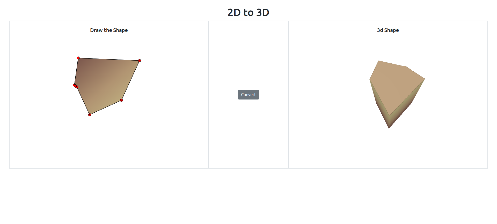

# Draw Shapes in 2D and visualize it in 3D

This web app allows users to draw shapes directly on the canvas, and then visualize those shapes in 3D. It's built using HTML, CSS, JavaScript, and Bootstrap. Users can easily create and interact with their shapes, enhancing their understanding and creativity in a dynamic 3D environment.



## Tech Stack

The website is built using the following technologies:

* HTML
* CSS
* JS
* Bootstrap

## Features

* Fully responsive web app
* Allows users to draw shapes on canvas
* Provides interactive 3D visualization of the drawn shapes

## Usage

To use the agency site, simply follow this steps :

1. Clone the repository :

```bash
   git clone https://github.com/chiragpgauswami/2D-to-3D.git
```

2. Open the project folder :

```bash
   cd 2D-to-3D
```

3. Install dependencies :

```bash
   npm install
```

4. Start the development server :

```bash
   npm run dev
```

5. Open your web browser and visit http://localhost:5173 to see the website.

&nbsp;

## Customization

You can customize the Webapp's UI by modifying the CSS styles in the style.css file. Feel free to experiment with different colors, fonts, and layout arrangements.

## Contributing

Contributions are welcome! If you find any issues or want to add new features, please open an issue or submit a pull request.

## Author

This project was created by Chirag P. Gauswami.

## License

This project is Open Source you can use it.

## Links

- [Source Code](https://github.com/chiragpgauswami/2D-to-3D)
- [Demo](https://chiragpgauswami.github.io/2D-to-3D)
